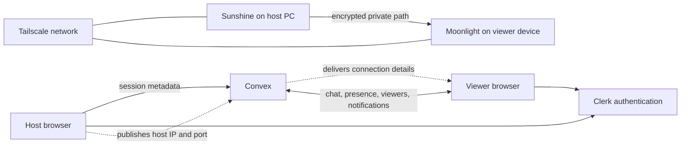

# Alodust

Alodust is an open-source, friends-first watch-party and game-stream coordination platform. It provides accounts, friend discovery, invitations, presence, stream setup, viewer tracking, and real-time chat while the media stream travels directly between participants.

The application is currently an early-stage web prototype. Its primary streaming path combines [Sunshine](https://github.com/LizardByte/Sunshine) on the host, [Moonlight](https://moonlight-stream.org/) on each viewer, and [Tailscale](https://tailscale.com/) for private connectivity. An OBS/RTMP setup flow is also present, but Alodust does not include or deploy an RTMP media server.

## What Alodust does

- Authenticates users with Clerk and synchronizes their profiles to Convex.
- Manages friends, friend requests, blocks, custom groups, and expiring invite links.
- Imports and matches connections from Discord and Steam when those integrations are configured.
- Tracks online, away, offline, and streaming presence in real time.
- Creates public, friends-only, or invite-only stream sessions.
- Publishes stream connection details and setup guidance to viewers.
- Tracks active viewers, current viewer count, and peak viewers.
- Provides live stream chat and notifications through Convex subscriptions.
- Supports Sunshine/Moonlight and OBS-oriented host workflows.

Alodust does **not** currently capture, transcode, relay, or render the video itself. For Sunshine streams, viewers leave the browser workflow to connect with Moonlight. For OBS streams, they use VLC or another RTMP-compatible client and require a separately running RTMP server.

## How it works



1. A user signs in through Clerk. The client upserts a corresponding Convex user and updates presence as the page visibility changes.
2. The host configures a Tailscale device in Settings and starts Sunshine or prepares an OBS workflow.
3. Starting a stream creates a Convex stream record, changes the host's presence to `streaming`, and notifies eligible friends.
4. Convex subscriptions immediately update lobbies, chat, notifications, and viewer lists.
5. The viewer connects to the host outside the web page: Moonlight connects to Sunshine over Tailscale, or an RTMP player connects to the configured OBS endpoint.
6. Ending a session marks the stream and active viewer records as ended and returns the host to online status.

This separation keeps high-bandwidth media off the application backend. Convex handles the control plane; Sunshine/Moonlight or OBS handles the media plane.

## Technology stack

| Layer | Technology | Responsibility |
| --- | --- | --- |
| UI | React 18, TypeScript, React Router | Pages, routing, and interaction |
| Styling | Custom CSS, Framer Motion | Responsive neon-themed interface and motion |
| Build | Vite 5 | Development server and production bundle |
| Backend | Convex | Database, queries, mutations, actions, cron jobs, and real-time subscriptions |
| Authentication | Clerk | Sign-up, sign-in, sessions, and account identity |
| Private network | Tailscale | Encrypted connectivity between host and viewers |
| Primary media path | Sunshine + Moonlight | Low-latency capture, encoding, transport, and playback |
| Optional media path | OBS + external RTMP server/player | Broadcast-oriented streaming |
| Integrations | Discord OAuth, Steam OpenID/Web API | Account connection and friend import |

## Requirements

For local web development:

- Node.js 18 or newer
- npm 9 or newer
- A free [Convex](https://www.convex.dev/) account/project
- A [Clerk](https://clerk.com/) application for authentication

For an end-to-end Sunshine stream:

- Sunshine installed and running on the host computer
- Moonlight installed on every viewing device
- Tailscale installed on the host and viewers
- The devices must be able to reach each other on the same tailnet, or be shared through a valid Tailscale sharing/ACL configuration
- Hardware encoding support is recommended for the host

For the optional integrations, create a Discord application and/or obtain a Steam Web API key.

## Local setup

### 1. Install dependencies

From the repository root:

```bash
npm install
```

The repository uses an npm workspace; this installs both root and `web` dependencies.

### 2. Configure and start Convex

Run Convex from the `web` directory because that directory contains the backend functions:

```bash
cd web
npx convex dev
```

On the first run, follow the Convex prompt to sign in and create or select a development deployment. Convex generates the client URL and writes the deployment settings to `web/.env.local`.

Keep this process running while developing. It watches `web/convex`, deploys function changes, and regenerates `web/convex/_generated` types.

### 3. Configure browser environment variables

Create or update `web/.env.local`:

```dotenv
# Required
VITE_CONVEX_URL=https://your-deployment.convex.cloud
VITE_CLERK_PUBLISHABLE_KEY=pk_test_your_key

# Optional: Discord integration
VITE_DISCORD_CLIENT_ID=your_discord_client_id
VITE_DISCORD_REDIRECT_URI=http://localhost:5173/auth/discord/callback

# Optional: Steam integration
VITE_STEAM_REDIRECT_URI=http://localhost:5173/auth/steam/callback
```

`VITE_CONVEX_URL` is required at startup. Without a Clerk publishable key the provider renders in a limited development mode, but authenticated application flows will not work correctly.

Add the local Clerk routes and origin to the allowed URLs in the Clerk dashboard. Add each OAuth callback URI exactly as written to the matching provider's application settings.

### 4. Configure server-side integration secrets

Secrets used by Convex actions must be stored in Convex, never in a `VITE_` variable:

```bash
cd web
npx convex env set DISCORD_CLIENT_ID your_discord_client_id
npx convex env set DISCORD_CLIENT_SECRET your_discord_client_secret
npx convex env set STEAM_API_KEY your_steam_web_api_key
```

Only set the values for integrations you intend to use. Restart or redeploy the relevant environment after changing its configuration.

### 5. Start the web application

In another terminal, from the repository root:

```bash
npm run dev
```

Vite serves the application at [http://localhost:5173](http://localhost:5173) and opens it in the default browser.

## Streaming setup

### Sunshine and Moonlight

1. Install Tailscale on all participating devices and connect them to an appropriate tailnet.
2. Install and configure Sunshine on the host.
3. In Alodust, open **Settings** and save the host's Tailscale IPv4 address and device name.
4. Open **Go Live**, select Sunshine, confirm the readiness checks, choose quality and privacy, and start the session.
5. On a viewer device, open the stream page and copy the displayed Tailscale address.
6. Add that host in Moonlight. On the first connection, complete Moonlight's PIN pairing in the Sunshine web interface.

The browser probes Sunshine at `https://localhost:47989` and periodically reports whether it appears available. Browsers may block this probe because of Sunshine's certificate or CORS policy, so a failed readiness check does not always mean Sunshine is stopped.

### OBS

The OBS workflow creates an RTMP URL in the form `rtmp://<tailscale-ip>:1935/live` and a generated stream key. Configure those values under **OBS → Settings → Stream → Custom**.

This repository does not contain an RTMP ingest or playback server. You must run and secure one separately on the host or network. Viewers then open the resulting RTMP stream in VLC or another compatible player. OBS WebSocket detection uses the default port `4455` only as a readiness signal.

## Available commands

Run these from the repository root unless noted otherwise:

| Command | Description |
| --- | --- |
| `npm run dev` | Start the Vite development server |
| `npm run build` | Type-check and create a production bundle in `web/dist` |
| `npm run preview` | Preview the production bundle locally |
| `npm run lint --workspace=web` | Run the configured web lint command |
| `npx convex dev` | Run and watch the Convex development backend (from `web`) |
| `npx convex deploy` | Deploy Convex functions for production (from `web`) |

There is currently no automated test suite.

## Project structure

```text
alodust/
├── package.json              # npm workspace and root scripts
├── web/
│   ├── convex/
│   │   ├── schema.ts         # Database tables and indexes
│   │   ├── users.ts          # Profiles, presence, and Tailscale devices
│   │   ├── friends.ts        # Friendship lifecycle
│   │   ├── friendGroups.ts   # Custom friend groups
│   │   ├── invites.ts        # Expiring invitation links
│   │   ├── streams.ts        # Stream sessions and viewer tracking
│   │   ├── chat.ts           # Real-time stream chat
│   │   ├── notifications.ts  # User notifications
│   │   ├── imports.ts        # Discord/Steam friend matching
│   │   ├── oauth.ts          # Server-side external API calls
│   │   └── crons.ts          # Daily expired-invite cleanup
│   ├── public/               # Static browser assets
│   ├── src/
│   │   ├── components/       # Shared UI and friend/stream widgets
│   │   ├── hooks/            # Authentication and Sunshine helpers
│   │   ├── pages/            # Route-level application screens
│   │   ├── providers/        # Clerk and Convex providers
│   │   ├── services/         # Discord and Steam browser flows
│   │   └── styles/           # Design tokens and global CSS
│   └── vite.config.ts
└── README.md
```

## Data and real-time behavior

Convex stores users, friendships, friend groups, invite links, streams, viewer sessions, chat messages, scheduled events, notifications, and imported friends. Indexed queries retrieve common views such as live streams, friend requests, unread notifications, and chronological chat.

React components subscribe to Convex queries, so backend changes are pushed to connected clients without polling. Mutations update stream lifecycle, presence, viewers, and messages. A daily Convex cron removes expired invitation links at 03:00 UTC.

## Performance characteristics

Alodust's perceived performance has two independent parts:

- **Application updates:** chat, viewer lists, presence, and stream metadata use Convex's real-time subscription model. Their latency depends on the client-to-Convex network path and deployment region.
- **Media latency and quality:** video bypasses React and Convex. Sunshine performs capture and hardware-accelerated encoding; Moonlight receives and decodes it over the Tailscale path. Resolution, frame rate, bitrate, codec, host GPU, viewer decoder, network routing, and congestion determine the result.

The interface advertises a target below 50 ms, but this repository contains no reproducible benchmark or guarantee for that number. Tailscale may establish a direct peer-to-peer path or fall back to a relay, and relay paths generally add latency. Measure the complete setup on the hardware and networks you intend to support before making production claims.

Because media is not relayed through Convex, adding viewers does not consume Convex video bandwidth. It can, however, increase the host's outbound bandwidth and encoding workload depending on the selected streaming system.

## Current status and limitations

Alodust should be treated as a development prototype, not a production-ready streaming service.

- Browser-native WebRTC playback is represented in the data model but is not implemented.
- Sunshine video opens in Moonlight; it is not embedded in the watch page.
- OBS support supplies configuration metadata only and requires an external RTMP server and player.
- Sunshine and OBS detection can produce false negatives because browser security policies restrict localhost probes.
- Tailscale IP discovery is manual; users save a device address in Settings.
- Several Convex functions trust user and host IDs supplied by the browser rather than deriving authorization from a verified server identity. Add Convex/Clerk authentication checks and enforce stream privacy before exposing this service publicly.
- Stream lookup by ID does not currently enforce friends-only or invite-only access on the server.
- Generated invite codes and OBS keys use `Math.random()` and are not suitable as production security tokens.
- Discord OAuth state is stored in `sessionStorage`; Steam callback verification and provider hardening require further work.
- Scheduled events exist in the schema, but no complete event workflow is exposed in the current UI.
- `/features` and `/docs` are placeholder routes.
- There are no automated tests, CI workflow, rate limits, moderation controls, or formal performance benchmarks yet.

## Production checklist

Before deploying publicly:

1. Enforce authenticated identity and object-level authorization in every Convex query, mutation, and action.
2. Enforce stream privacy on the backend and avoid returning private connection details to unauthorized clients.
3. Replace random invite codes and stream keys with cryptographically secure, revocable tokens.
4. Add input validation, abuse prevention, rate limiting, chat moderation, and retention policies.
5. Configure separate production Clerk, Convex, Discord, and Steam credentials and exact callback URLs.
6. Decide whether to keep external Moonlight/RTMP playback or implement a browser-native media path.
7. Add unit, integration, and end-to-end tests plus deployment checks.
8. Benchmark signaling and media performance across direct and relayed network paths.
9. Serve the Vite build behind HTTPS with SPA fallback routing to `index.html`.

## Troubleshooting

### `Missing VITE_CONVEX_URL`

Run `npx convex dev` from `web`, or add the deployment URL to `web/.env.local`, then restart Vite.

### Sign-in pages do not work

Confirm `VITE_CLERK_PUBLISHABLE_KEY` is valid and that `http://localhost:5173` and the application routes are allowed in Clerk.

### Sunshine is reported as unavailable

Open `https://localhost:47990` directly, confirm Sunshine is running, and accept or configure its local certificate if appropriate. The browser status probe may still be blocked by CORS; verify the service outside Alodust as well.

### Moonlight cannot reach the host

Confirm both devices are connected to Tailscale, test the displayed host IP, review tailnet ACLs/sharing, and verify Sunshine ports are allowed by the host firewall. Pair Moonlight with Sunshine before launching a stream.

### OBS connects nowhere

An OBS installation alone is not an RTMP server. Run a compatible RTMP ingest service at the displayed address and port, allow it through the firewall, and configure OBS with both the generated URL and key.

### PowerShell blocks `npm`

On Windows systems with a restrictive execution policy, run `npm.cmd install` and `npm.cmd run dev`, or use Command Prompt instead of the PowerShell script shim.

## Contributing

Contributions are welcome. Keep changes focused, run the build before submitting, and include tests when introducing testable behavior. Security-related improvements—particularly Convex authorization and privacy enforcement—are the highest-priority area.

Suggested workflow:

```bash
git checkout -b feature/short-description
npm install
npm run build
```

Then open a pull request explaining the user-facing change, technical approach, and verification performed.

## License

The package metadata declares the project as MIT licensed. A root `LICENSE` file is not currently included; add the full MIT license text before distributing or accepting contributions under those terms.
